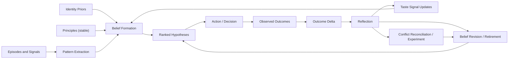

# Cognition Interaction Diagram

```mermaid
flowchart LR
    A["Identity Priors"] --> D["Belief Formation"]
    B["Principles (stable)"] --> D
    C["Episodes and Signals"] --> E["Pattern Extraction"]
    E --> D
    D --> F["Ranked Hypotheses"]
    F --> G["Action / Decision"]
    G --> H["Observed Outcomes"]
    H --> I["Outcome Delta"]
    I --> J["Reflection"]
    J --> K["Belief Revision / Retirement"]
    K --> F
    J --> L["Taste Signal Updates"]
    L --> D
    J --> M["Conflict Reconciliation / Experiment"]
    M --> K
```
