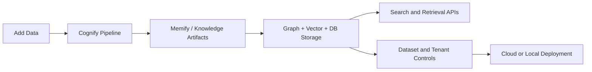

# Cognee System Diagram (Evidence-Aligned)

```mermaid
flowchart LR
    A["Add Data"] --> B["Cognify Pipeline"]
    B --> C["Memify / Knowledge Artifacts"]
    C --> D["Graph + Vector + DB Storage"]
    D --> E["Search and Retrieval APIs"]
    D --> F["Dataset and Tenant Controls"]
    F --> G["Cloud or Local Deployment"]
```
