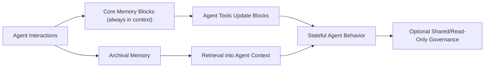

# Letta System Diagram (Evidence-Aligned)

```mermaid
flowchart LR
    A["Agent Interactions"] --> B["Core Memory Blocks (always in context)"]
    A --> C["Archival Memory"]
    B --> D["Agent Tools Update Blocks"]
    C --> E["Retrieval into Agent Context"]
    D --> F["Stateful Agent Behavior"]
    E --> F
    F --> G["Optional Shared/Read-Only Governance"]
```
