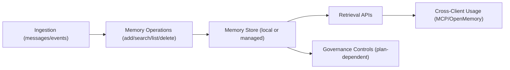

# Mem0 System Diagram (Inferred + Evidence-Aligned)

```mermaid
flowchart LR
    A["Ingestion (messages/events)"] --> B["Memory Operations (add/search/list/delete)"]
    B --> C["Memory Store (local or managed)"]
    C --> D["Retrieval APIs"]
    D --> E["Cross-Client Usage (MCP/OpenMemory)"]
    C --> F["Governance Controls (plan-dependent)"]
```
