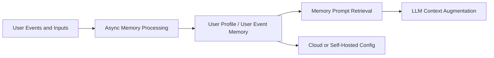

# Memobase System Diagram (Inferred + Evidence-Aligned)

```mermaid
flowchart LR
    A["User Events and Inputs"] --> B["Async Memory Processing"]
    B --> C["User Profile / User Event Memory"]
    C --> D["Memory Prompt Retrieval"]
    D --> E["LLM Context Augmentation"]
    C --> F["Cloud or Self-Hosted Config"]
```
