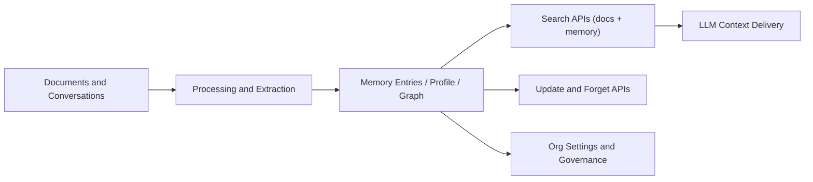

# Supermemory System Diagram (Inferred + Evidence-Aligned)

```mermaid
flowchart LR
    A["Documents and Conversations"] --> B["Processing and Extraction"]
    B --> C["Memory Entries / Profile / Graph"]
    C --> D["Search APIs (docs + memory)"]
    C --> E["Update and Forget APIs"]
    D --> F["LLM Context Delivery"]
    C --> G["Org Settings and Governance"]
```
