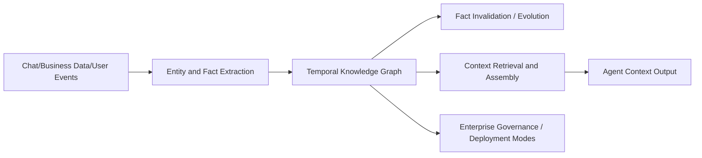

# Zep System Diagram (Evidence-Aligned)

```mermaid
flowchart LR
    A["Chat/Business Data/User Events"] --> B["Entity and Fact Extraction"]
    B --> C["Temporal Knowledge Graph"]
    C --> D["Fact Invalidation / Evolution"]
    C --> E["Context Retrieval and Assembly"]
    E --> F["Agent Context Output"]
    C --> G["Enterprise Governance / Deployment Modes"]
```
