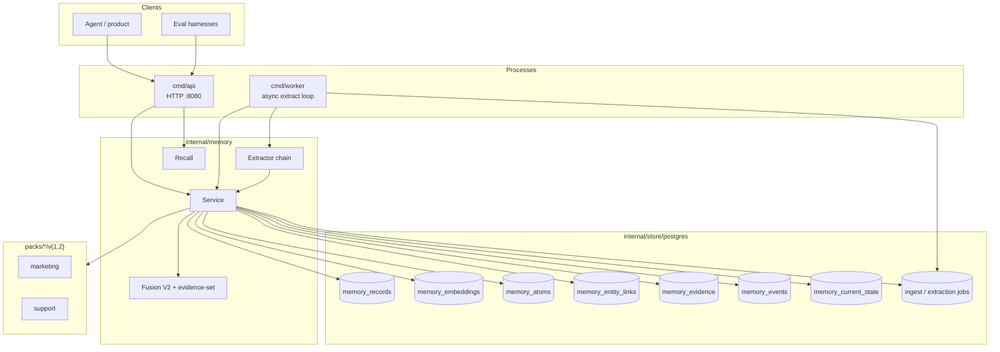
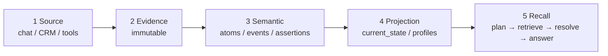
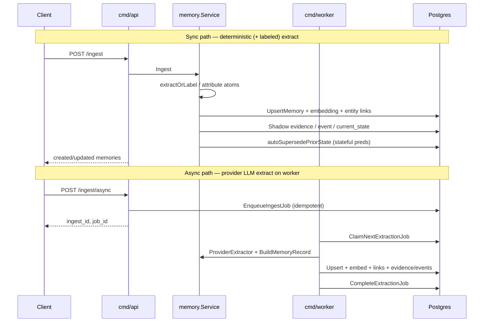
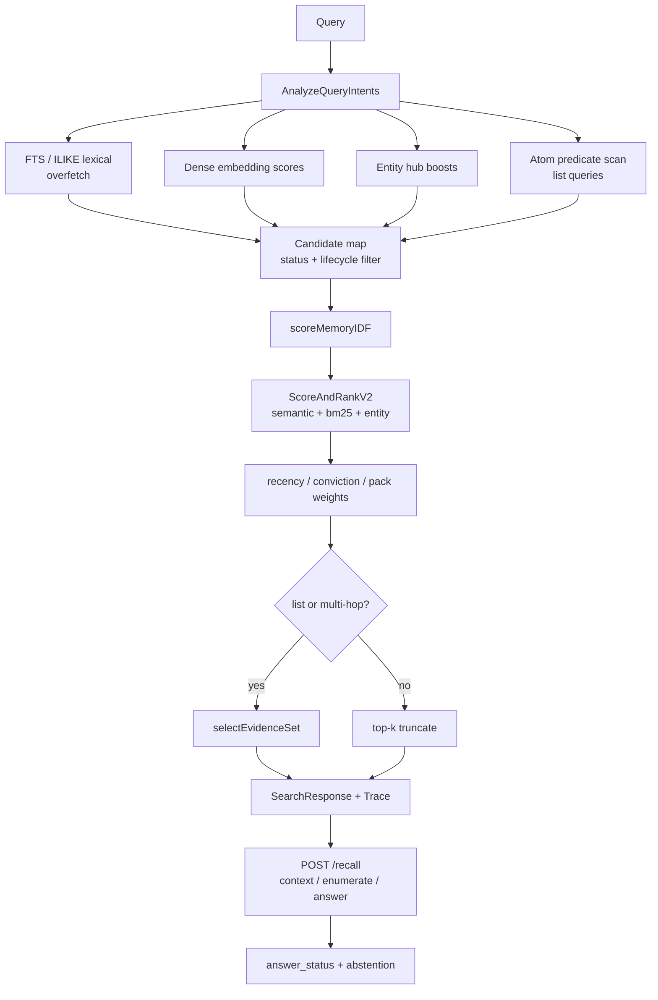
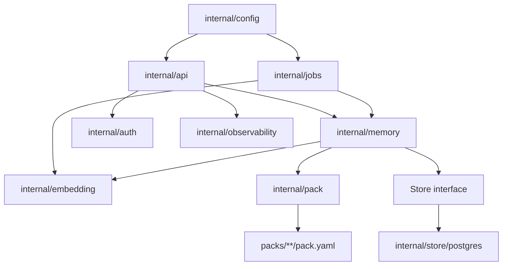
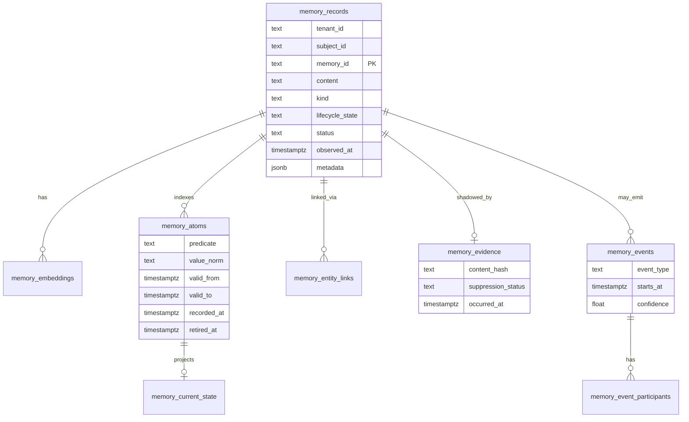
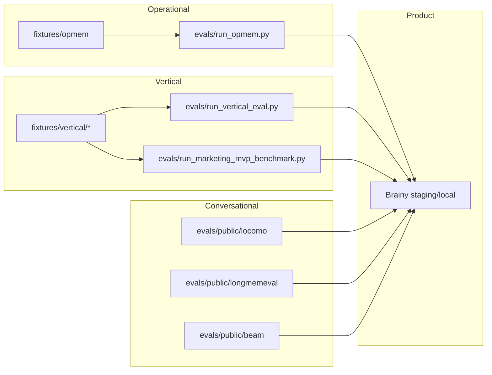

# Brainy codebase graph

**Audience:** External agents and human reviewers  
**Date:** 2026-08-04  
**Companion:** [external-agent-assessment-pack.md](./external-agent-assessment-pack.md) (single handoff artifact)  
**Machine-readable:** [codebase-graph.json](./codebase-graph.json)

This document is the structural map of the Brainy repository: runtime topology, data planes, package ownership, and eval surfaces. Prefer reading this before diving into `internal/memory/service.go` (~2k LOC).

---

## 1. Runtime topology

---

## 2. Five memory planes (target architecture)

Product code is mid-migration: `memory_records` remains the primary read path; evidence/events/current_state are **shadow / MVP** (migrations 15–16).

| Plane | Today (code) | Tables / types |
| --- | --- | --- |
| Source | `IngestRequest` messages | raw ingest payload + jobs |
| Evidence | shadow write on upsert | `memory_evidence` |
| Semantic | records + atoms + events MVP | `memory_records`, `memory_atoms`, `memory_events` |
| Projection | current-state upsert for stateful preds | `memory_current_state` |
| Recall | `SearchOpt` + `POST /recall` | Fusion V2, evidence-set, answer_status |

---

## 3. Ingest paths

**Entry points**

| Path | File |
| --- | --- |
| API boot | `cmd/api/main.go` |
| Worker boot | `cmd/worker/main.go` (+ `scripts/worker-respawn.sh`) |
| HTTP routes | `internal/api/router.go` |
| Sync ingest | `internal/memory/service.go` → `Ingest` |
| Async claim | `internal/jobs/processor.go` → `ProcessNext` |
| LLM extract | `internal/memory/provider_extractor.go` |
| Deterministic extract | `internal/memory/extractor.go` |
| Attribute atoms | `internal/memory/attribute_atoms.go` |

---

## 4. Retrieval / recall path

**Critical flags**

| Env | Default | Effect |
| --- | --- | --- |
| `BRAINY_FUSION_V2` | **on** | Mem0-style additive fusion; semantic-only floor 0.78 |
| `BRAINY_ENTITY_RANKING` | off | Overlap rerank (prior A/B regressor) |
| `BRAINY_IDF_RANKING` | off | IDF-weighted lexical |
| `BRAINY_ENSURE_FTS_INDEX` | off (API) | Controlled GIN build |

---

## 5. Package ownership graph

| Package | Responsibility | Hot files |
| --- | --- | --- |
| `internal/memory` | Domain logic: ingest, search, recall, lifecycle, fusion | `service.go`, `recall.go`, `fusion_v2.go`, `attribute_atoms.go` |
| `internal/store/postgres` | Persistence + migrations | `store.go`, `atoms.go`, `events.go`, `entity_hub.go`, `migrations.go` |
| `internal/api` | HTTP + auth wiring | `router.go` |
| `internal/jobs` | Async worker processor | `processor.go` |
| `internal/pack` | Vertical pack registry | `pack.go` |
| `internal/embedding` | Local hash + OpenAI-compatible provider | `local.go`, provider client |
| `evals/` | OpMem, vertical, public LoCoMo/LME/BEAM | `run_opmem.py`, `evals/public/*` |
| `packs/` | Domain models v1/v2 | `marketing`, `support` |
| `fixtures/` | Hermetic eval cases | `opmem`, `vertical/*` |
| `docs/research/` | Strategy + external briefings | this tree |

---

## 6. Data model (logical)

**Migrations:** v1–v16 in `internal/store/postgres/migrations.go`  
Notable: v12 entity links, v13 atoms, v14 FTS tsv, v15 bitemporal atom cols, v16 evidence/events/current_state.

---

## 7. API surface

| Method | Path | Handler area | Notes |
| --- | --- | --- | --- |
| GET | `/healthz` | api | liveness |
| GET | `/metrics` | api | process metrics |
| POST | `/ingest` | Service.Ingest | sync |
| POST | `/ingest/async` | Service.IngestAsync | queue |
| GET | `/memories/search` | Service.SearchOpt | hybrid + Trace |
| POST | `/recall` | Service.Recall | context/enumerate/answer |
| POST | `/events` | ApplyDomainEvent | batch invalidation |
| POST | `/memories/{id}/suppress` | Suppress | status=suppressed |
| POST | `/memories/{id}/correct` | Correct | rewrite + stickiness |
| POST | `/memories/{id}/supersede` | Supersede | lifecycle supersession |

---

## 8. Eval & benchmark graph

**Anti-benchmax guard:** `internal/memory/overfit_denylist_test.go` blocks LOCOMO surface forms in product code.

---

## 9. Suggested reading order for external agents

1. [external-agent-assessment-pack.md](./external-agent-assessment-pack.md) — self-contained assessment brief  
2. This graph + [codebase-graph.json](./codebase-graph.json)  
3. [sota-end-to-end-program.md](./sota-end-to-end-program.md) — program of record  
4. [program-execution-status.md](./program-execution-status.md) — latest measured numbers  
5. `internal/memory/service.go` `SearchOpt` + `fusion_v2.go` + `recall.go`  
6. `internal/store/postgres/migrations.go` (v12–v18; evidence v2 + pgvector 768)  
7. One vertical pack: `packs/support/v2/` and `fixtures/vertical/support/`  

**Hazards (honest):** hosted ANN is `vector(768)` after mig 18; HNSW valid on staging; hash/128 residue still needs re-embed. Packs v2 sidecars + support/marketing FSMs load at registry time. `/recall` consumes structured evidence packets with optional hybrid LLM reader (`BRAINY_RECALL_LLM`). Architect PR1–PR7 closed 2026-08-05; recall-contract steps 1–5 landed on `dev` 2026-08-07. **Next:** atomic compiler (R1b) + held-out coverage audit → entities/relation projection. R0/R1a/R1c landed in PR #113 (`21a632b`); local LoCoMo remasure **10/30** is a dip. See [sota-representation-path.md](./sota-representation-path.md).
---

## 10. Non-goals / traps for reviewers

- Do **not** treat eval harness answer prompts as product behavior; prefer `POST /recall`.  
- Do **not** recommend LOCOMO-named regexes or held-out conv tuning (rejected).  
- Graph DB is **gated research**, not current roadmap (ADR-004).  
- Staging Render services track **`dev`**; `main` is the production git line.
